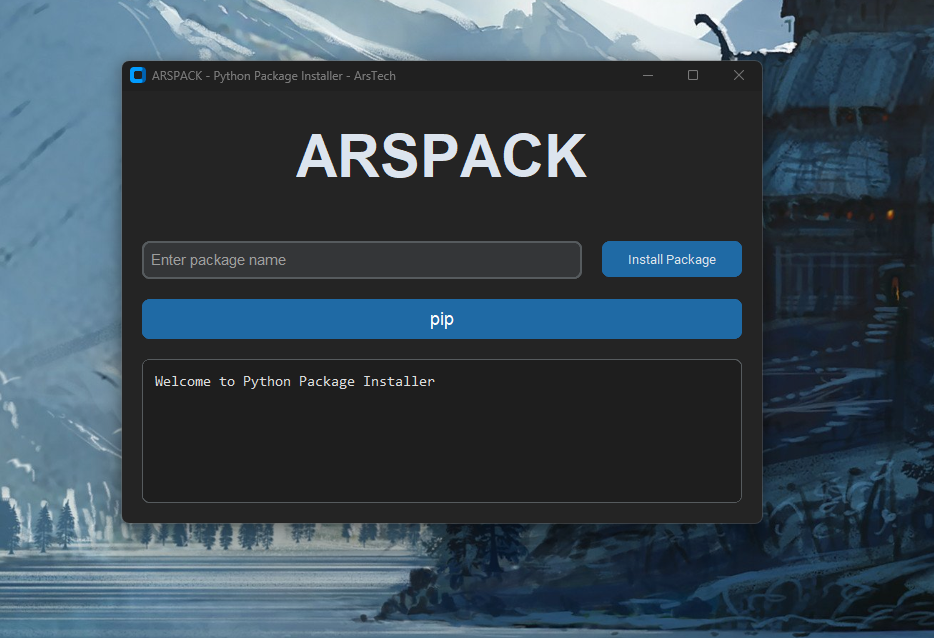
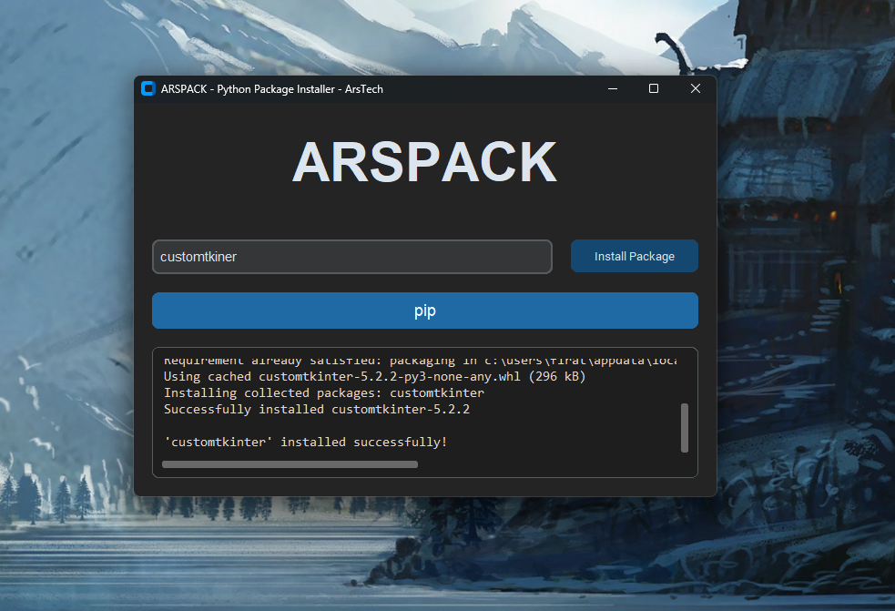

# ARSPACK - Python Package Installer

## Overview
ARSPACK is a user-friendly Python package installer built using **CustomTkinter**. It allows users to install Python packages using either **pip** or **conda**, with a simple and modern GUI. The tool also provides a terminal-style log window to track installation progress and errors.

## Features
- 📦 **Install Python Packages** using pip or conda.
- 🎨 **Modern GUI** with a clean and responsive design.
- 🚀 **Asynchronous Execution** to prevent UI freezing.
- 🔍 **Package Existence Check** before installation.
- 📜 **Real-time Log Display** for installation status.

## Installation
To run ARSPACK, you need to have Python installed along with **CustomTkinter**. Install the required dependencies with:

```bash
pip install customtkinter
```

## Usage
Run the application using:

```bash
python __init__.py
```

### Steps:
1. Enter the package name in the input field.
2. Choose the installation method (**pip** or **conda**).
3. Click the **Install Package** button.
4. View the progress in the log window.

## Requirements
- Python 3.x
- CustomTkinter
- pip (for package installation)
- Conda (optional, if using conda for installation)

## Screenshots



## License
This project is licensed under the **MIT License**.

## Author
Developed by **[e500ky][https://github.com/e500ky]**.

